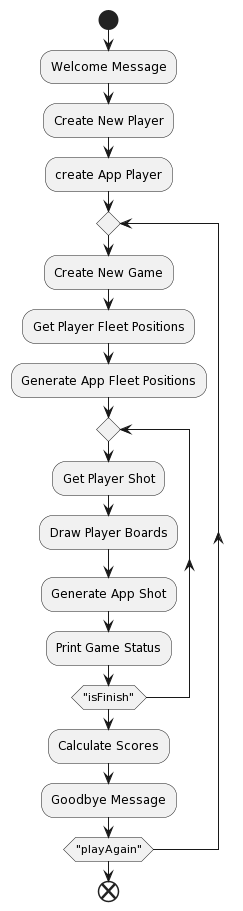

### Batalla Naval en Java

  

#### Resumen
El proyecto consiste en una aplicación de consola en Java para el juego de estrategia "Batalla Naval", donde los jugadores posicionan barcos en un tablero e intentan hundir los del adversario. La aplicación ofrece una experiencia interactiva, con un juego contra la computadora y un sistema de puntuación para múltiples partidas.

#### Funcionalidades
- **Inicio del Juego:** Saludo inicial y solicitud del nombre del jugador para personalizar la experiencia.
- **Configuración de Barcos:** Posicionamiento manual de 20 barcos en un tablero de 10x10 por parte del jugador.
- **Juego Automático:** Colocación aleatoria de barcos por la computadora, garantizando un reto constante.
- **Interacción de Juego:** Oportunidad para el jugador de disparar a coordenadas específicas en el tablero del adversario y respuesta automática de la computadora con disparos aleatorios.
- **Visualización de Estado de Juego:** Muestra de los tableros actualizados después de cada turno, ocultando la posición de los barcos de la computadora.
- **Conteo y Finalización del Juego:** Verificación de los barcos restantes y determinación de un ganador.
- **Puntuación y Registro:** Asignación de puntos por victorias y barcos hundidos, con un registro acumulativo durante la ejecución de la aplicación.

#### Tecnologías y Metodología de Implementación
- **Lenguaje de Programación:** Java.
- **Enfoque Modular:** Separación clara entre la lógica del juego y la interfaz de usuario.
- **Control de Entradas:** Validación rigurosa de las entradas de coordenadas mediante expresiones regulares.
- **Manejo de Estado del Juego:** Clases para gestionar los estados del juego, jugadores, tableros y barcos, asegurando un manejo eficaz del flujo del juego.
- **Algoritmos de Juego:** Implementación de lógicas para el posicionamiento de barcos y la realización de disparos, tanto para el jugador como para la computadora.
- **Interacción Usuario-Computadora:** Uso intensivo de la clase `Scanner` para la interacción en consola, proporcionando una experiencia de usuario fluida y dinámica.

  

#### Pruebas y Validación
- **Pruebas Unitarias:** Desarrollo de tests unitarios para métodos públicos y privados, incluyendo pruebas de límites para validar la robustez de la solución.
- **Gestión de Errores:** Implementación de controles de errores y validaciones para asegurar que las entradas y acciones dentro del juego sigan las reglas establecidas.

#### Impacto del Proyecto
Este proyecto muestra una aplicación compleja de habilidades técnicas en Java y principios de diseño de software, con un enfoque en la creación de una experiencia de juego interactiva y atractiva. Es una demostración efectiva de la capacidad para desarrollar aplicaciones de consola que requieren una lógica de juego sofisticada y una interacción detallada con el usuario.
